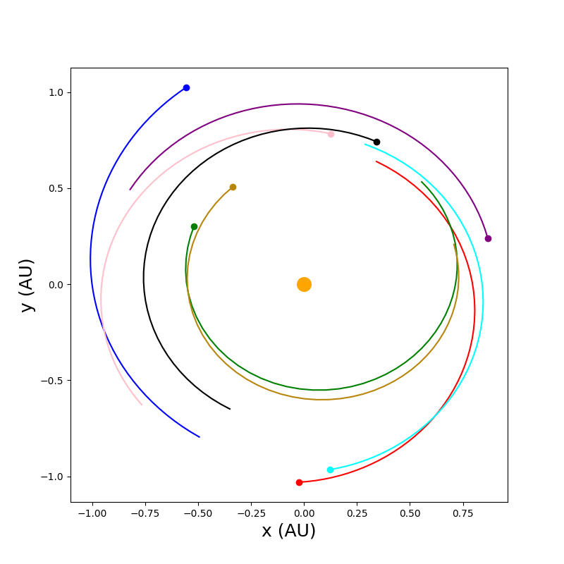
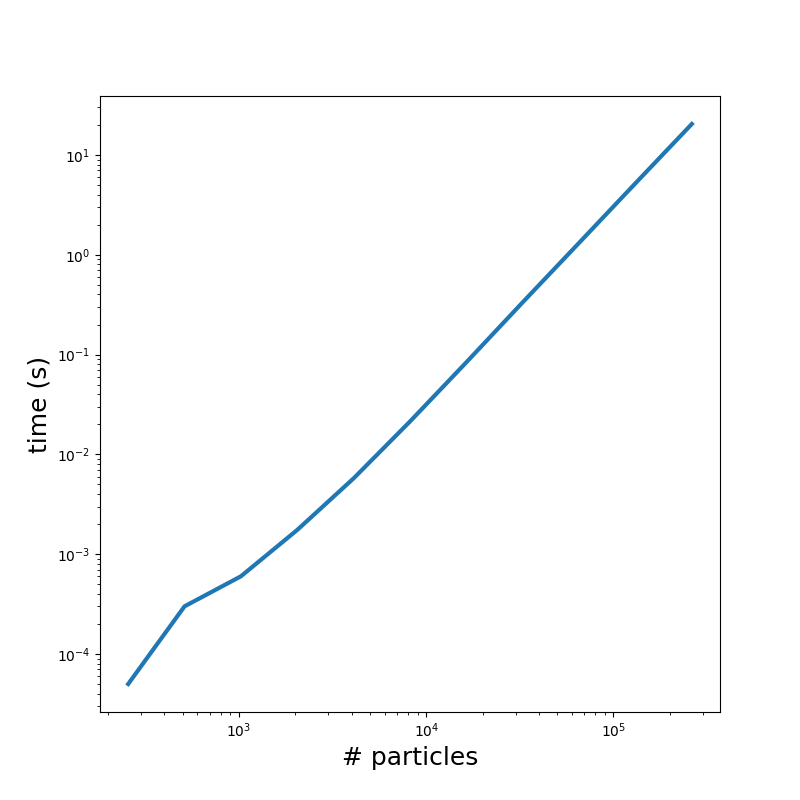

# particle-fortran

## Introduction

Welcome to my particle simulation project. This project is a contiuation of a couple of my previous projects: one a C++ particle simulation I wrote in graduate school, and the other a CUDA fluid simulation. I found that I wanted to explore better paralelization than what was achived in my CUDA fluid simulation project. To modernize and improve parallelization, I have decided to swap to a more-portable compute library with OpenMP and to write multi-device code using MPI. I also wanted to update my previous particle simulation with better output rendering, which I will write in python. The result will be a simulated dust cloud of particles orbiting the sun at a radius between Venus and Earth. The simulation is an N-body problem of asteroid-sized particles which will be allowed to collide with each other via perfectly inelasitic collisions in order to form larger object.

The primary learning objectives of this project are in working with Fortran, OpenMP, and MPI to yeild parallel code. I will then gather some performance benchmarks on CPU, single-GPU, and multi-GPU implementations.

## A CPU particle Simulation

### Code

To begin, I want to write a simulation that runs purely in the CPU. I learned my lesson about how to lay out memory, and we definately want to favor using a struct of arrays instead of an array of structs. Here is the data type that we will use for the particles:

```fortran
type :: particle_t
    ! Positions
    real(8), allocatable :: x(:)
    real(8), allocatable :: y(:)

    ! Momentums
    real(8), allocatable :: px(:)
    real(8), allocatable :: py(:)

    ! Accelerations
    real(8), allocatable :: ax(:)
    real(8), allocatable :: ay(:)

    ! Other variables
    real(8), allocatable :: m(:)  ! mass
    real(8), allocatable :: r(:)  ! radius, computed from mass\
    logical, allocatable :: merged(:)
end type particle_t
```

I then wanted to randomly distribute the particles. The only note is that we are generating particles in an anulus. If we select a radius at random, then we will get a higher distribution of particles closer to the central star. To prevent this, we can either generate particles in cartesian coordinates and then check the radius bounds or normalize based on the amount of area. I chose to normalize by area. This ultimately results in the least amount of calculations to perform, but it ultimately negligible in terms of compute time:

```fortran
subroutine initialize_particles()
    integer :: i
    real(8) :: orbital_radius, start_angle, orbital_momentum  ! placeholders for random number generator

    ! Allocate arrays
    allocate(particles%x(num_particles), particles%y(num_particles))  ! positions
    allocate(particles%px(num_particles), particles%py(num_particles))  ! momentums
    allocate(particles%ax(num_particles), particles%ay(num_particles))  ! accelerations
    allocate(particles%m(num_particles), particles%r(num_particles), particles%merged(num_particles))  ! other

    call random_seed()
    do i = 1, num_particles
        ! randomly distribute the positions of the particles in the allowed anulus
        call get_random_number(orbital_radius, radius_lower**2, radius_upper**2)  ! temp radius
        orbital_radius = sqrt(orbital_radius)
        call get_random_number(start_angle, dble(0.0), 2.0*C_PI)  ! temp angle
        particles%x(i) = orbital_radius * cos(start_angle)
        particles%y(i) = orbital_radius * sin(start_angle)

        call get_random_number(particles%m(i), mass_lower, mass_upper)  ! evenly distribute the mass
        particles%r(i) = (particles%m(i) / C_Density * 0.75 / C_PI)**(1.0/3.0)  ! compute the size of the object from the mass and density

        ! generate the momentums
        orbital_momentum = sqrt(C_G * C_M_s / orbital_radius) * particles%m(i)  ! compute the optimal orbital momentum magnitude from the mass and orbital radius
        call get_random_number(orbital_momentum, orbital_momentum * (1-velocity_noise_bound), &
            orbital_momentum * (1+velocity_noise_bound))  ! get a random momentum magnitude
        particles%px(i) =  orbital_momentum * particles%y(i) / orbital_radius  ! assign x and y momentum to be in 
        particles%py(i) = -orbital_momentum * particles%x(i) / orbital_radius

        particles%merged(i) = .False.

    end do

end subroutine initialize_particles
```

There are really only two more steps. We need to make sure that we are checking for collisions and merging particles. When they collide, they will perfractly maintain momentum and form a new single particle at the center of mass of the two objects. This is done by assigning all properties to one particle, and marking the other as "merged" meaning it will not appear in future calcilations.

```fortran
subroutine handle_collisions(particles, num_particles)

integer :: i, j
real(8) :: distance, x_com, y_com, combined_mass

type(particle_t), intent(inout) :: particles
integer, intent(in) :: num_particles

do i = 1, num_particles - 1
    if (particles%merged(i)) then
        cycle  ! skips if the first particles has collided
    end if

    ! check for solar merges
    call get_distance(distance, particles%x(i), particles%y(i), dble(0.0), dble(0.0))
    if (distance .le. C_R_s) then
        ! TODO :: for now we assume the particle is so small that it has no mass comapred to sun
        particles%merged(i) = .true.
        cycle
    end if

    ! check for particle-to-particle merging
    do j = i+1, num_particles
        if (particles%merged(j)) then
            cycle  ! skips if the second particles has collided
        end if

        call get_distance(distance, particles%x(i), particles%y(i), particles%x(j), particles%y(j))
        if (distance .le. particles%r(i) + particles%r(j)) then  ! true if they should collide perfectly inelasically
            ! add the momentum
            particles%px(i) = particles%px(i) + particles%px(j)
            particles%py(i) = particles%py(i) + particles%py(j)

            ! compute the center of mass and move particles
            combined_mass = particles%m(i) + particles%m(j)
            particles%x(i) = (particles%x(i) * particles%m(i) + particles%x(j) * particles%m(j)) / combined_mass
            particles%y(i) = (particles%y(i) * particles%m(i) + particles%y(j) * particles%m(j)) / combined_mass
            
            ! update mass and radius
            particles%m(i) = combined_mass
            particles%r(i) = (particles%m(i) / C_Density * 0.75 / C_PI)**(1.0/3.0)

            ! count the second particle as merged
            particles%merged(j) = .True.
        end if
    end do
end do

end subroutine handle_collisions
```

We also want to step in time. This is the easiest part. We simply iterate over all object to compute the acceleration, and then use the euler method to integrate forward. The only clever trick here is that when we compute the gravitational force between two particles, there is an equal and opposite force. Therefore we can save an additional step by assigning the force to the other particle, and then iterating over only half of the objects.

```fortran
subroutine take_time_step(particles, num_particles, dt)

        integer :: i, j
        real(8) :: acceleration_x, acceleration_y, velocity_x, velocity_y, distance

        type(particle_t), intent(inout) :: particles
        integer, intent(in) :: num_particles
        real(8), intent(in) :: dt

        ! reset the memory on acceleration
        do i = 1, num_particles
            particles%ax(i) = dble(0.0)
            particles%ay(i) = dble(0.0)
        end do

        do i = 1, num_particles

            call get_distance(distance, particles%x(i), particles%y(i), dble(0.0), dble(0.0))
            particles%ax(i) = particles%ax(i) - (C_G * C_M_s * particles%x(i) / (distance**3))
            particles%ay(i) = particles%ay(i) - (C_G * C_M_s * particles%y(i) / (distance**3))

            do j = i+1, num_particles
                if (particles%merged(j)) then
                    cycle  ! skips if the second particles has collided
                end if

                acceleration_x = -C_G * particles%m(i) * particles%m(j) * (particles%x(i) - particles%x(j)) / (distance**3)
                acceleration_y = -C_G * particles%m(i) * particles%m(j) * (particles%y(i) - particles%y(j)) / (distance**3)

                particles%ax(i) = particles%ax(i) + acceleration_x / particles%m(i)
                particles%ax(j) = particles%ax(j) - acceleration_x / particles%m(j)
                particles%ay(i) = particles%ay(i) + acceleration_y / particles%m(i)
                particles%ay(j) = particles%ay(j) - acceleration_y / particles%m(j)
            end do

        end do

        ! use those accelerations to compute the updated positions and momentums using eulers method
        do i = 1, num_particles

            velocity_x = (particles%px(i) / particles%m(i)) + dt * particles%ax(i)
            velocity_y = (particles%py(i) / particles%m(i)) + dt * particles%ay(i)

            particles%x(i) = particles%x(i) + dt * velocity_x
            particles%y(i) = particles%y(i) + dt * velocity_y
            particles%px(i) = particles%m(i) * velocity_x
            particles%py(i) = particles%m(i) * velocity_y

        end do

    end subroutine take_time_step
```

### Results

I wrote a small python script that allows me to view the output data. Here is the result for an 8-body system that I simulated, and configured to run for about a quarter of a year.



I also gathered performance metrics, averaged over 20 time steps, for an increasing number of particles. Those results are shown here:



This is already a very fast performance for baseline, with the largest test case being 2^18 particles which averaged 20.43 seconds. We also clearly see the expected n-squared order time complexity from the system.